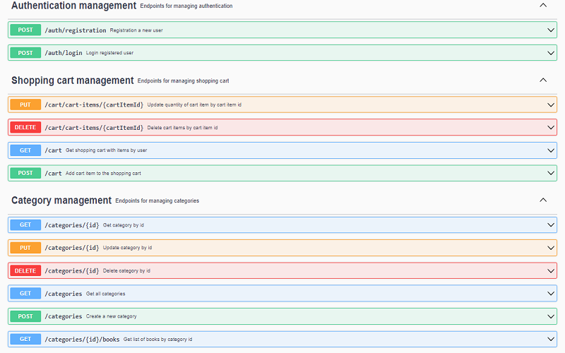
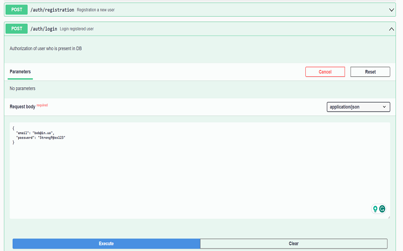
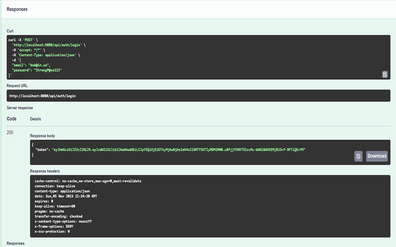

# Online Book Store 📚
For your attention very useful application for ordering books. 
The primary conception of an online bookstore is to simplify the process of choosing and ordering books according 
to your preferences with one click.

## Features
- Comfortable and simple management of books, shopping cart and cartitems
- Strong authentication system
- Fast and optimized application performance
- Smart site navigation

## Used Technologies
This application include next list of technologies :
- java: 17
- tomcat: 10.1.12
- spring boot: 3.1.5 (with jpa, web, security, swagger etc.)
- mySQL: 8.0.35
- liquibase: 4.20.0

## API Functionalities 
The bookstore application controller slice follows according to REST principles. 
The controllers below are responsible for managing HTTP requests and responses.
#####
- **AuthenticationController :** in this controller manages requests from users who want to register or login into our application. 
Here realized security part is with password encrypted for the safety user's data. Login can be done using a password and email or JWT token.
#####
- **BookController :** is dedicated to receiving and managing requests related to adding, updating, retrieving, and searching for books.
#####
- **CategoryController :** here as a user, you can send requests for getting a book or a list of books by category. As a manager (admin) you can add, delete or update categories.
#####
- **ShoppingCartController :** in this controller response is for managing your shopping cart, you can add items, delete, get or update.
#####
- **OrderController :** in this controller handling requests related to creating and retrieving orders, as well as updating the status of orders.

## Structure of Controllers  
- ### AuthenticationController (/auth):
1. POST /registration - Register a new user
2. POST /login - Login user and return JWT token
- ### BookController (/books):
1. GET - Get a list of all available books
2. GET /{id} - Get book by id
3. POST - Create a new book
4. DELETE /{id} - Delete book by id
5. PUT /{id} - Update a book by id
6. GET /search - Search books by params (author, isbn, title, price)
- ### CategoryController (/categories):
1. POST - Create a new category
2. GET - Get a list of all available categories
3. GET /{id} - Get a category by id
4. PUT /{id} - Update a category by id 
5. DELETE /{id} - Delete a category by id; 
6. GET /{id}/books - Get a list of all available books by category id
- ### ShoppingCartController (/cart):
1. GET - Get a user shopping cart with all cart items
2. POST - Add a new cart item into shopping cart
3. PUT - /cart-items/{cartItemId} - Update a cart item by cart item id
4. DELETE - /cart-items/{cartItemId} - Delete cart item by id
- ### OrderController (/orders):
1. GET - Get list of orders 
2. POST - Create an order and after that clear shopping cart
3. GET - /{orderId}/items - Get a list of all items from order
4. GET - /{orderId}/items/{itemId} - Get an order item from order 
5. PATCH - /{id} - Change of order status

## How to run application

Clone the project :

```bash
  git clone https://github.com/s-hrynus/spring-online-book-shop.git
```
Build project using maven :
```bash
  mvn clean install
```
To run application locally use next command :
```bash
  mvn spring-boot:run
```
To run application using Docker container you need :

```bash
  docker build -t book-store .
  docker-compose build
  docker-compose up
  ```

## How to work with runned application
You can check how to work the application in two ways: using Swagger UI or using Postman.
######
Using swagger you just need to move to the link: http://localhost:8080/api/swagger-ui/index.html#/
#####

#####

#####

####
In the [video][video_url] I will show how to manage an online bookstore as a user and admin. For it, I will use Postam.

[video_url]: httt:will_add_soon